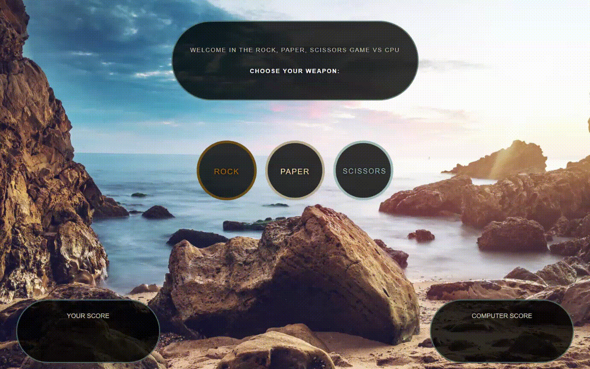

# Rock-paper-scissors

Play with the computer [here](https://wblachut.github.io/Rock-Paper-Scissors_TheOdinProject/)!

## PROJECT: LIBRARY

## Description

Simple rock-paper-scissors web app. Project was a part of The Odin Project Web Development learning curriculum.

## Concepts used and learned:

- DOM manipulation
- Event Listeners
- CSS styling

## Tools:

- Visual Studio Code
- Javascript
- CSS3
- HTML5

## Some ideas to apply in future:

- optimize background image
- update counters display when player or PC wins round
- add sound effects of rock, paper and scissors
- add multiplayer option
